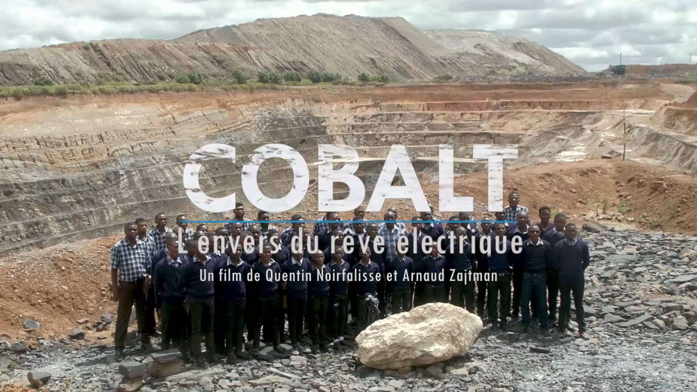

Lien du documentaire : [Youtube](https://www.youtube.com/watch?v=GBHgv7--i6Q)

<!--more-->

## Résumé d'Arte :

*Disponible sur Arte jusqu'au 24/12/2024*

Indispensable à l'industrie, notamment à la fabrication des batteries qui équipent les véhicules électriques, le cobalt est devenu un minerai hautement stratégique. De la République démocratique du Congo à la Scandinavie, une remarquable enquête sur la face cachée de son extraction. 

Pour atteindre la neutralité carbone à l'horizon 2050, l'Union européenne a décidé d'interdire à partir de 2035 la vente des véhicules neufs à moteur thermique ou hybride. Un défi pour l'industrie automobile du continent, tenue de développer sa production de voitures et d'utilitaires légers 100 % électriques. Associé au lithium, au nickel et au manganèse, le cobalt assure la stabilité des cellules des batteries et empêche qu'elles n'entrent en combustion. Avec l'accélération de la mobilité électrique, ce sous-produit de l'extraction du cuivre est devenu un minerai hautement stratégique. Ses plus grands gisements mondiaux se trouvent en République démocratique du Congo (RDC), dans les provinces du Lualaba et du Haut-Katanga. Si les investisseurs étrangers, principalement chinois, y contrôlent les trois quarts des sites miniers industriels, 20 % des mines y sont artisanales, principalement autour de la ville de Kolwezi : parfois âgés de moins de 10 ans, des "creuseurs" y risquent leur vie dans des boyaux de fortune pour des rétributions misérables. En quête de souveraineté pour s'affranchir du quasi-monopole de la Chine dans la fourniture de batteries, l'Europe encourage de son côté la multiplication des projets miniers sur son territoire afin d'alimenter les chaînes de production qu'elle compte développer.

Batterie de fléaux

Pollution à l'acide des sols et des cours d'eau, expropriation de leurs terres des paysans et des éleveurs, travail des enfants, corruption des élites pour l'octroi de permis d'exploitation... : en RDC, la course au cobalt - chaque batterie en nécessite 10 kilos - s'accompagne d'une cohorte de fléaux. En Scandinavie, où les principaux gisements européens ont été identifiés, ce sont les risques environnementaux qui suscitent les craintes des populations locales. Donnant la parole à des industriels de l'automobile et du secteur minier, au vice-président de la Commission européenne Maros Sefcovic, à des ONG et à des activistes engagés dans la défense des droits humains et la protection de l'environnement, cette enquête remarquable pointe la face cachée d'un marché stratégique, dont la demande est promise à une croissance exponentielle pour réaliser le rêve européen de neutralité carbone.

**Documentaire d'Arnaud Zajtman et Quentin Noirfalisse (2022, 1h26mn)**

